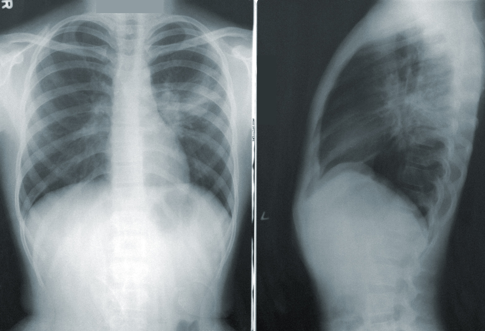

# New Tools for Pneumonia Diagnosis

## Lydia Cuffman, Bobby Gerberick, Nick Tjandra

<p align="center">
  
</p>
Photo by <a href="https://unsplash.com/@cdc?utm_source=unsplash&utm_medium=referral&utm_content=creditCopyText">CDC</a> on <a href="https://unsplash.com/photos/NMZdj2Zu36M?utm_source=unsplash&utm_medium=referral&utm_content=creditCopyText">Unsplash</a>

GitHub repository: https://github.com/nickthetj/GroupProject4
Presentation: 

## Overview

Pneumonia is a very serious illness that can lead to dire health outcomes including death. Proper diagnosis is the first step in the process of successful treatment. Pneumonia is most often diagnosed by expert evaluation of a chest x-ray. In some healthcare settings, the number of potential pneumonia cases outpaces the capacity of trained personnel to review them. We have built a model as a first evaluator, which provides an overworked healthcare worker with fewer x-rays to evaluate without having to worry about failing to catch a pneumonia case.

## Business Problem

Pneumonia is a leading cause of death among children under five, so it is of vital importance to healthcare systems and their patients that pneumonia is quickly and accurately diagnosed. In some settings there are more possible cases than there is time to evaluate them. For these clinics and hospitals, it would be very valuable to reduce that human workload, if that could be done without missing true cases of childhood pneumonia. If the first look could be automated, that would allow the experts an opportunity to direct their expertise towards other pressing medical concerns.

We developed a model that takes in an x-ray of child's lungs and predicts whether they have pneumonia. A false positive would be saying they do when they don't. A false negative would mean saying a child does not have pneumonia when they actually do. In this setting, a false positive is acceptable while a false negative is close to intolerable. False positives mean the healthcare worker has to examine a few extra x-rays. Considering the alternative is looking at ALL of the x-rays, this is still a major improvement. A false negative means a child does not receive appropriate treatment for a serious disease, which is a much bigger issue. Our model prioritizes recall above all else.

We did not optimize for recall exclusively however, because that would be essentially the system as it currently exists: assume everyone has pneumonia and check for where you're wrong. Instead, we designed a model that sought to optimize for both recall and accuracy, and then selected the model with the highest recall score.

As the x-rays were going to be further examined by a medical professional, our model did not need to be easily interpretable. In any marginal cases the final call would be made by a doctor or other expert, so a black box model was not an issue, especially if such a model increased recall scores. Additionally, images are not suited to transparent models anyway, so a somewhat mysterious model was unavoidable.


## Data Understanding


Our data set is a collection of x-rays of children's lungs found at https://data.mendeley.com/datasets/rscbjbr9sj/3, collected through collaboration of the University of California, San Diego and Guangzhou Women and Children's Medical Center. Several different data sets are available at that link. We focused exclusively on the chest x-rays. As chest x-rays are the primary method of diagnosing pneumonia, these images are obviously relevant to our question. The target variable for our analysis is "pneumonia" vs. "normal." The images are already sorted into training, testing, and validation sets. The validation set was insufficiently sized for our purposes so we ignored it, instead creating a validation set within the training set.


## Data Preparation

Image data does not require the type of cleaning that numerical or language data does. The primary thing we had to do was scale down the images to ensure our computers could effectively work with the information. We opted to scale the large scans down to 64 x 64 pixels, which allowed us to try many models in a reasonable amount of time. After landing on our better models, we then ran them with larger versions of the image to see how much upping the resolution improved the outcomes. Our better models performed extremely well even at the lowest resolution.

## Modeling

Initially, we implemented a dummy model predicting pneumonia with perfect recall but an accuracy of 75%. Subsequent iterations aimed to improve accuracy without compromising recall on true pneumonia cases.

Through various adjustments like adding convolutional layers, tweaking learning rates, incorporating image augmentation, and experimenting with dropout regularization, several models achieved high scores in both recall and accuracy. The final model, a convolutional neural network with multiple layers at a 300 x 300 image resolution, demonstrated exceptional performance with a recall score of 99.4% and an accuracy of 95.6% on the validation set.

## Evaluation

We determined our best model based on our validation set. We saw that our model was neither under nor overfit because its scores were similar on both the training and validation data sets.

After selecting our best model, we evaluated it with our holdout testing set. The model scored 0.9949 for recall and 0.8478 for accuracy.


The lower accuracy score was unexpected. It is not a bad score, but it is not in line with the scores we saw for our training and validation. Were it not for the validation set, we would assume our model is overfit to the training data. The validation data, however, supports our interpretation that our model is well-tuned. It is possible that the images just didn't break into sets in a particularly representative way. Short of procuring our own set of comparable x-rays, there's not much we can do to address this issue.

Though the lower accuracy score raised an eyebrow, we are still confident that the model is strong and generalizable. Even as accuracy dropped, it did not drop precipitously and the recall score remained incredibly high. The model might have more false positives, but as long as false negatives are still kept to the absolute minimum, this model is still effectively reducing the workload for healthcare professionals without elevating the risks for patients.


Our model misses almost no true pneumonia cases (and even a human expert likely errs occasionally) and it significantly reduces the number of x-rays that have to be analyzed. In an overtaxed healthcare setting, that's all upside.


## Conclusions

We would recommend that clinics or hospitals that see a lot of juvenile patients with suspected pneumonia send their chest x-rays through our model. Medical experts can review the x-rays flagged as positive. This process will free up human resources and will allow providers to treat their patients more quickly and effectively. For cases classified as negative, this allows the care team to pursue other explanations for the patient's illness, and in positive cases also IDed as positive by the experts, the care team can quickly begin appropriate treatments.

## Next Steps

Given more time, we would consider pooling the training and testing sets together and doing a random split instead of using the provided train/test sets. Training our model on our own randomly split sets would allow us to see if the disparity in validation and testing accuracy scores that we saw was truly an artifact of a funky data split. As other data scientists have also mentioned issues with the accuracy scores on the testing set, it might also be valuable to have a medical expert review those images to ensure they are properly labelled. We don't have the skills to do that, and it might be time- or cost-prohibitive for our potential clients. Even without these further investigations, we still feel quite confident in the value our model could provide in a medical setting.

This model only improves one step in the treatment of pneumonia. If there are backlogs in ordering a chest x-ray or actually performing the x-ray, then the benefits of our model will be limited. Healthcare providers should evaluate all steps in the diagnosis process to see if other bottlenecks can be mitigated.

The data set images are labelled for bacterial or viral pneumonia. These conditions can require different treatment. Current recommendation is that all unclassified cases of pediatric pneumonia be treated with antibiotics, because x-ray does not meaningfully differentiate between the two types. A possible next step would be to build a model that tries to do this. Perhaps a computer model can find distinctions the naked eye cannot, and if it can, unnecessary antibiotics could be avoided.

## Repository Structure
```
├── data
├── images
├── working_notebooks
├── README.md
├── main_notebook.ipynb
├── .gitignore
├── LICENSE
└── presentation.pdf
```
